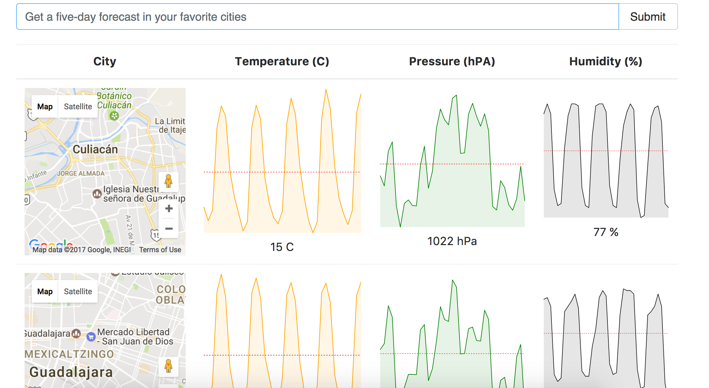

# React Weather app

Google maps, Sparklines and redux and linked with openweathermap.

Clone or download this repository.

Install dependencies
```
npm install
```

Run webpack server
```
npm start
```

Browse over the server
```
http://localhost:8080/
```


